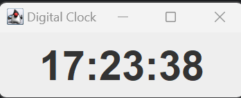

# Digital Clock Application

## Overview

The **Digital Clock Application** is a simple Java GUI application that displays the current time in a digital format. 
The time is updated every second to reflect the current system time. 
This project demonstrates basic Java Swing components and real-time updates using a `Timer`.

## Features

- **Real-Time Clock**: Displays the current time in hours, minutes, and seconds.
- **Automatic Update**: The time updates every second to ensure accuracy.

## Technologies

- **Java**: Core language for the application.
- **Swing**: Java GUI toolkit used for creating the user interface.
- **Timer**: Used to update the clock every second.

## Getting Started

### Prerequisites

- **Java Development Kit (JDK)**: Ensure that you have JDK 8 or higher installed on your machine.

### Installation

1. **Clone the Repository**:

    ```bash
    git clone https://github.com/davidegrigioni/digitalclock.git
    cd digitalclock
    ```

2. **Open the Project**:

    Open the project in your preferred Java IDE (e.g., IntelliJ IDEA, Eclipse).

3. **Build and Run**:

    - **In IntelliJ IDEA**:
      - Open the `DigitalClock` class.
      - Click the `Run` button or use `Shift + F10` to execute the application.

    - **In Eclipse**:
      - Right-click on the `DigitalClock` class.
      - Select `Run As > Java Application`.

## Usage

1. **Launch the Application**:
   - Run the `DigitalClock` class to start the application.

2. **View Time**:
   - The application window will display the current time and update every second.

## Code Explanation

### Main Components

- **`DigitalClock` Class**:
  - Sets up the JFrame and layout.
  - Uses `JLabel` to display the time.
  - Updates the time every second using a `Timer`.

### Key Methods

- **`updateClock()`**:
  - Updates the time displayed on the JLabel using the current system time.

## Screenshots



## Contributing

Feel free to fork the repository and submit pull requests with improvements or bug fixes.

## License

This project is licensed under the MIT License. See the [LICENSE](LICENSE) file for details.

## Acknowledgments

- Inspired by basic GUI programming concepts in Java.
- Utilizes Java Swing for creating a simple graphical user interface.

---

For any issues or questions, please open an issue in the repository or contact me directly.
